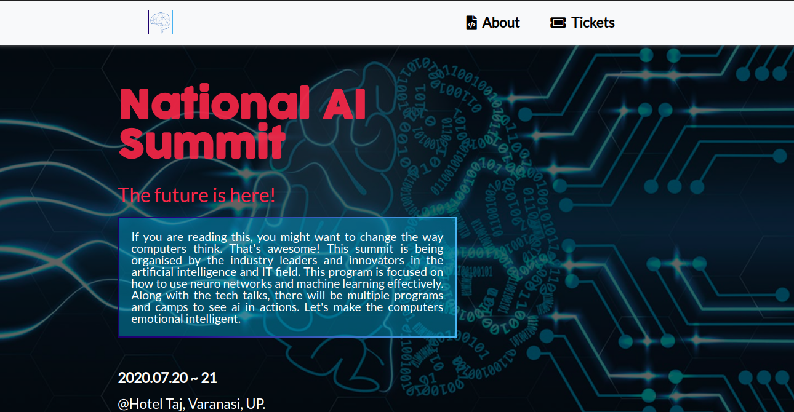
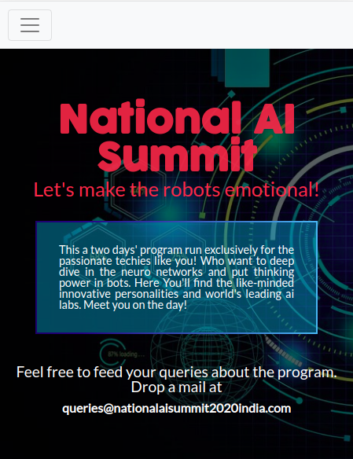

# HTML-CSS-Conference-Page-Capstone
This Project is meant to be developed around the given graphical criteria for the webpage. It falls under the capstone project to finish the Microverse's HTML and CSS section.

> 
This project is focused on creating a responsive website with three pages by the given design. In this project [This Design](https://www.behance.net/gallery/29845175/CC-Global-Summit-2015) has been used. All of the pages are based on the design inspiration followed by suggested font and colour combination. I have also followed the responsiveness inspiration provided be the requirement design using the best practices of HTML AND CSS with GitHub process flow.

## Desktop Screenshot

## Small screen Screenshot Index Page

## Small Screen Screenshot About Page

## Built With

- Twitter’s Bootstrap framework
- HTML
- CSS

## Live Demo

[Live Website Demo](https://rawcdn.githack.com/Prabhakarzx/HTML-CSS-Conference-Page-Capstone/306194756c4f2ba1d7a32e3813a21b1336441aed/index.html)

## Project Video Presentation

[Live Video Demo](https://www.loom.com/share/84c66a4ff2eb4585923721a4e7a5e7ba)

### Prerequisites

- Browser (Google Chrome, Mozilla Firefox, Safari or any other browser)

### Setup

- Download or clone the repository's files
- Open the index.html file using any web browser of your choice
- Live demo has been provided above and you can access all three pages from their respective live demo links.
- Additionally, You can go to [githack](https://raw.githack.com) and put the link of HTML file there and access the site from generated link.

## Author

👤 **Prabhakar Pandey**

- Github: [@Prabhakarzx](https://github.com/Prabhakarzx)
- Twitter: [@Prabhakarzx](https://twitter.com/prabhakarzx)
- Linkedin: [@Prabhakarzx](https://www.linkedin.com/in/prabhakarzx/)

## 🤝 Contributing

Contributions, issues and feature requests are welcome!

Feel free to check the [issues page](https://github.com/Prabhakarzx/HTML-CSS-Conference-Page-Capstone/issues).

## Show your support

Give a ⭐️ if you like this project!

## Acknowledgments

- Microverse
- [Cindy Shin](https://www.behance.net/adagio07)
- GitHub
- TheOdinProject
- Bootstrap
- Grammarly
- Google Images
- executivespeakers
- Behance
- notion.so

## 📝 License

This project is [MIT](lic.url) licensed.
